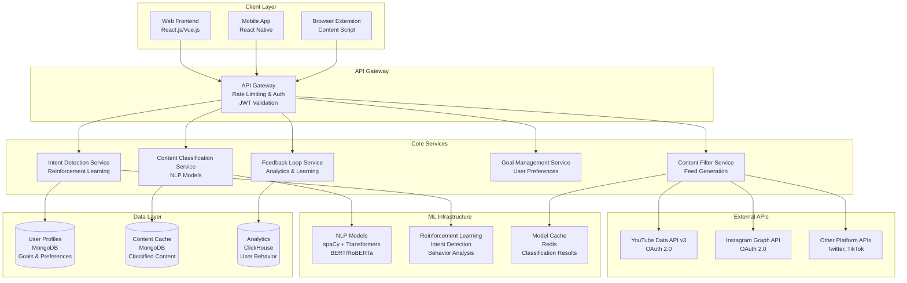

# Design Document: AI-Powered Content Filtering Application

## Overview

The AI-powered content filtering application is designed as a microservices architecture that provides real-time, personalized content curation across multiple platforms. The system leverages transformer-based NLP models for content classification, reinforcement learning for user intent detection, and a scalable cloud infrastructure to deliver sub-500ms response times for content analysis.

The architecture follows an event-driven design pattern where user interactions trigger intent analysis, which updates goal profiles, which in turn influence content filtering decisions. The system maintains user privacy through data anonymization and encryption while providing continuous learning capabilities through feedback loops.

## Architecture

### High-Level Architecture



### Service Communication Pattern

The system uses an event-driven architecture with asynchronous message passing:

1. **User Interaction Events** → Intent Detection Service
2. **Intent Updates** → Goal Management Service  
3. **Content Requests** → Content Classification Service
4. **Classification Results** → Content Filter Service
5. **User Feedback** → Feedback Loop Service → Model Updates

### Technology Stack

**Backend Services**:
- **Python 3.9+** with Flask/FastAPI for microservices
- **Node.js** for real-time notifications and WebSocket connections
- **Redis** for caching and session management
- **MongoDB** for user data and content storage
- **ClickHouse** for analytics and time-series data

**Machine Learning**:
- **spaCy 3.4+** for NLP preprocessing and pipeline management
- **Transformers (Hugging Face)** for BERT/RoBERTa content classification
- **scikit-learn** for traditional ML algorithms and feature engineering
- **TensorFlow/PyTorch** for custom model training and inference

**Infrastructure**:
- **Docker** containers with Kubernetes orchestration
- **AWS/Google Cloud** for scalable infrastructure
- **Nginx** as reverse proxy and load balancer
- **Prometheus + Grafana** for monitoring and alerting

## Components and Interfaces

### 1. Intent Detection Service

**Purpose**: Analyzes user behavior patterns to identify current goals and intent using reinforcement learning.

**Key Components**:
- **Behavior Tracker**: Monitors user interactions, click patterns, and session duration
- **Intent Classifier**: Uses RL algorithms to predict user intent from behavior patterns
- **Session Manager**: Maintains user session state and context
- **Pattern Analyzer**: Identifies recurring behavior patterns and preferences

**Interface**:
```python
class IntentDetectionService:
    def analyze_user_interaction(self, user_id: str, interaction: UserInteraction) -> IntentScore:
        """Analyze a single user interaction and update intent scoring"""
        pass
    
    def update_intent_profile(self, user_id: str, new_intent: Intent) -> bool:
        """Update user's intent profile based on detected patterns"""
        pass
    
    def get_current_intent(self, user_id: str) -> Intent:
        """Retrieve the current detected intent for a user"""
        pass
    
    def track_session_activity(self, user_id: str, activity: Activity) -> None:
        """Track user activity within a session for pattern analysis"""
        pass
    
    def predict_intent_change(self, user_id: str, context: Dict[str, Any]) -> float:
        """Predict likelihood of intent change based on current context"""
        pass
```

**Performance Requirements**:
- Intent updates within 2 seconds of behavior change
- Support for 10,000+ concurrent user sessions
- 99.9% uptime with graceful degradation
- Memory usage under 512MB per 1000 active sessions

### 2. Content Classification Service

**Purpose**: Uses transformer-based NLP models to analyze and score content relevance to user goals.

**Key Components**:
- **Text Preprocessor**: Cleans and normalizes content text using spaCy
- **Feature Extractor**: Generates embeddings using BERT/RoBERTa transformers
- **Relevance Scorer**: Calculates relevance scores (0.0-1.0) based on goal profiles
- **Classification Cache**: Stores previously classified content for performance
- **Model Manager**: Handles model loading, updating, and version management

**Interface**:
```python
class ContentClassificationService:
    def classify_content(self, content: ContentItem, goal_profile: GoalProfile) -> ClassificationResult:
        """Classify a single content item against user goals"""
        pass
    
    def batch_classify(self, content_batch: List[ContentItem], goal_profile: GoalProfile) -> List[ClassificationResult]:
        """Classify multiple content items efficiently"""
        pass
    
    def update_classification_model(self, feedback_data: FeedbackData) -> bool:
        """Update classification model based on user feedback"""
        pass
    
    def get_content_features(self, content: ContentItem) -> FeatureVector:
        """Extract feature vector from content for analysis"""
        pass
    
    def validate_classification_quality(self, results: List[ClassificationResult]) -> QualityMetrics:
        """Validate classification quality and confidence scores"""
        pass
```

**ML Pipeline Architecture**:
1. **Preprocessing Stage**:
   - Text cleaning and normalization using spaCy
   - Tokenization and sentence segmentation
   - Language detection and handling
   - Metadata extraction (title, description, tags)

2. **Feature Extraction Stage**:
   - Transformer embeddings (BERT-base-uncased)
   - TF-IDF features for keyword matching
   - Semantic similarity calculations
   - Content type and platform-specific features

3. **Classification Stage**:
   - Multi-class relevance scoring
   - Goal-specific classification heads
   - Confidence estimation using dropout sampling
   - Uncertainty quantification

4. **Post-processing Stage**:
   - Score normalization and calibration
   - Keyword matching and explanation generation
   - Performance metrics calculation
   - Result caching and storage

### 3. Content Filter Service

**Purpose**: Orchestrates content retrieval, classification, and personalized feed generation across multiple platforms.

**Key Components**:
- **Platform Aggregator**: Fetches content from multiple APIs simultaneously
- **Content Deduplicator**: Removes duplicate content across platforms
- **Feed Generator**: Creates personalized feeds based on relevance scores
- **Focus Mode Manager**: Implements strict filtering during focus sessions
- **Content Ranker**: Orders content by relevance, recency, and user preferences

**Interface**:
```python
class ContentFilterService:
    def generate_personalized_feed(self, user_id: str, platform: str, limit: int) -> PersonalizedFeed:
        """Generate a personalized content feed for the user"""
        pass
    
    def activate_focus_mode(self, user_id: str, duration: timedelta, threshold: float) -> FocusSession:
        """Activate focus mode with specified duration and filtering threshold"""
        pass
    
    def filter_content_batch(self, content: List[ContentItem], goal_profile: GoalProfile) -> FilteredContent:
        """Filter a batch of content based on goal profile"""
        pass
    
    def handle_blocked_content_access(self, user_id: str, content_id: str) -> AccessDecision:
        """Handle user attempts to access blocked content during focus mode"""
        pass
    
    def update_content_rankings(self, user_id: str, feedback: List[ContentFeedback]) -> bool:
        """Update content ranking algorithms based on user feedback"""
        pass
```

**Feed Generation Algorithm**:
1. **Content Aggregation**: Fetch content from all connected platforms
2. **Relevance Filtering**: Apply goal-based relevance thresholds
3. **Diversity Injection**: Ensure content diversity across topics and sources
4. **Temporal Balancing**: Mix recent and older relevant content
5. **Personalization**: Apply user-specific preferences and history
6. **Quality Assurance**: Validate feed quality and completeness

### 4. Goal Management Service

**Purpose**: Manages user-defined goals, priorities, and preference profiles with validation and lifecycle management.

**Key Components**:
- **Goal Validator**: Validates goal definitions and requirements
- **Priority Manager**: Handles goal prioritization and weighting
- **Lifecycle Tracker**: Manages goal states (active, paused, completed, archived)
- **Keyword Mapper**: Maps goals to relevant keywords and topics
- **Profile Generator**: Creates comprehensive goal profiles for classification

**Interface**:
```python
class GoalManagementService:
    def create_goal(self, user_id: str, goal: GoalDefinition) -> Goal:
        """Create a new goal with validation"""
        pass
    
    def update_goal_priority(self, user_id: str, goal_id: str, priority: float) -> bool:
        """Update goal priority with validation"""
        pass
    
    def get_active_goals(self, user_id: str) -> List[Goal]:
        """Retrieve all active goals for a user"""
        pass
    
    def generate_goal_profile(self, user_id: str) -> GoalProfile:
        """Generate comprehensive goal profile for content classification"""
        pass
    
    def archive_completed_goal(self, user_id: str, goal_id: str) -> bool:
        """Archive a completed goal and update user profile"""
        pass
```

**Goal Lifecycle Management**:
- **Creation**: Validate goal definition, extract keywords, set initial priority
- **Activation**: Monitor goal progress, track related content consumption
- **Adaptation**: Adjust keywords and priorities based on user behavior
- **Completion**: Archive goal, update user preferences, generate insights
- **Reactivation**: Allow users to reactivate archived goals with updated context

### 5. Platform Integration Layer

**Purpose**: Handles external API communication with comprehensive rate limiting, error recovery, and data normalization.

**Key Components**:
- **OAuth Manager**: Handles OAuth 2.0 flows for all platforms
- **Rate Limiter**: Implements platform-specific rate limiting strategies
- **Request Queue**: Manages API request queuing and prioritization
- **Response Normalizer**: Converts platform-specific responses to unified format
- **Error Handler**: Implements circuit breaker and retry patterns

**Interface**:
```python
class PlatformIntegrationService:
    def fetch_content(self, platform: str, user_token: str, params: Dict) -> ContentResponse:
        """Fetch content from specified platform with rate limiting"""
        pass
    
    def authenticate_user(self, platform: str, auth_code: str) -> UserToken:
        """Handle OAuth 2.0 authentication flow"""
        pass
    
    def handle_rate_limit(self, platform: str, user_id: str) -> RateLimitStatus:
        """Check and handle rate limiting for platform and user"""
        pass
    
    def normalize_content_format(self, platform: str, raw_content: Any) -> ContentItem:
        """Normalize platform-specific content to unified format"""
        pass
    
    def refresh_user_token(self, platform: str, refresh_token: str) -> UserToken:
        """Refresh expired OAuth tokens"""
        pass
```

**Platform-Specific Configurations**:

**YouTube Data API v3**:
- Rate Limit: 10,000 units/day, 100 units/100 seconds/user
- Authentication: OAuth 2.0 with scope `youtube.readonly`
- Content Types: Videos, playlists, channels, search results
- Quota Management: Implement request batching and caching

**Instagram Graph API**:
- Rate Limit: 200 requests/hour/user
- Authentication: OAuth 2.0 with scope `instagram_basic`
- Content Types: Posts, stories, reels, IGTV
- Webhook Integration: Real-time updates for new content

**Rate Limiting Strategy**:
- **Token Bucket Algorithm**: Per-user and per-platform quotas
- **Exponential Backoff**: Retry failed requests with increasing delays
- **Request Prioritization**: Prioritize real-time user requests over background tasks
- **Quota Monitoring**: Track usage and predict quota exhaustion

### 6. Feedback Loop Service

**Purpose**: Implements continuous learning through user feedback collection, behavior analysis, and model improvement.

**Key Components**:
- **Engagement Tracker**: Monitors user interactions and engagement metrics
- **Feedback Collector**: Gathers explicit and implicit user feedback
- **Analytics Engine**: Generates insights from user behavior patterns
- **Model Updater**: Triggers model retraining based on feedback data
- **Notification Manager**: Sends personalized notifications and alerts

**Interface**:
```python
class FeedbackLoopService:
    def track_user_engagement(self, user_id: str, content_id: str, engagement: EngagementMetrics) -> None:
        """Track user engagement with specific content"""
        pass
    
    def collect_explicit_feedback(self, user_id: str, content_id: str, rating: float, comments: str) -> None:
        """Collect explicit user feedback on content relevance"""
        pass
    
    def generate_user_insights(self, user_id: str, time_period: timedelta) -> UserInsights:
        """Generate personalized insights about user behavior"""
        pass
    
    def trigger_model_update(self, feedback_batch: List[FeedbackData]) -> ModelUpdateStatus:
        """Trigger model retraining with accumulated feedback"""
        pass
    
    def send_goal_reminder(self, user_id: str, distraction_context: DistractionContext) -> NotificationResult:
        """Send contextual reminder when user strays from goals"""
        pass
```

## Data Models

### Core Data Structures

```python
from dataclasses import dataclass, field
from datetime import datetime, timedelta
from typing import Dict, List, Optional, Any, Union
from enum import Enum

class ContentType(Enum):
    VIDEO = "video"
    IMAGE = "image"
    TEXT = "text"
    AUDIO = "audio"
    MIXED = "mixed"

class IntentType(Enum):
    LEARNING = "learning"
    ENTERTAINMENT = "entertainment"
    RESEARCH = "research"
    SOCIAL = "social"
    PRODUCTIVITY = "productivity"

class GoalStatus(Enum):
    ACTIVE = "active"
    PAUSED = "paused"
    COMPLETED = "completed"
    ARCHIVED = "archived"

@dataclass
class ContentItem:
    id: str
    platform: str
    external_id: str
    title: str
    description: str
    author: str
    author_id: str
    published_at: datetime
    content_type: ContentType
    duration_seconds: Optional[int]
    view_count: Optional[int]
    like_count: Optional[int]
    comment_count: Optional[int]
    tags: List[str]
    categories: List[str]
    thumbnail_url: Optional[str]
    content_url: str
    metadata: Dict[str, Any] = field(default_factory=dict)
    language: Optional[str] = None
    
@dataclass
class Goal:
    id: str
    user_id: str
    title: str
    description: str
    keywords: List[str]
    topics: List[str]
    priority: float  # 0.0 to 1.0
    status: GoalStatus
    created_at: datetime
    updated_at: datetime
    target_completion_date: Optional[datetime] = None
    progress_percentage: float = 0.0
    related_content_count: int = 0
    
@dataclass
class GoalProfile:
    user_id: str
    active_goals: List[Goal]
    priority_weights: Dict[str, float]
    keywords: List[str]
    topics: List[str]
    updated_at: datetime
    total_goals: int
    completion_rate: float
    average_priority: float
    
@dataclass
class ClassificationResult:
    content_id: str
    goal_profile_hash: str
    relevance_score: float
    confidence: float
    matched_keywords: List[str]
    matched_topics: List[str]
    topic_categories: List[str]
    processing_time_ms: int
    model_version: str
    explanation: Optional[str] = None
    
@dataclass
class Intent:
    user_id: str
    intent_type: IntentType
    confidence: float
    context: Dict[str, Any]
    detected_at: datetime
    expires_at: datetime
    session_id: str
    previous_intent: Optional[IntentType] = None
    
@dataclass
class PersonalizedFeed:
    user_id: str
    platform: str
    content_items: List[ContentItem]
    relevance_scores: List[float]
    generated_at: datetime
    expires_at: datetime
    total_items: int
    filtered_items: int
    average_relevance: float
    
@dataclass
class FocusSession:
    user_id: str
    session_id: str
    started_at: datetime
    duration: timedelta
    threshold: float
    blocked_attempts: int = 0
    content_accessed: int = 0
    goals_focused: List[str] = field(default_factory=list)
    
@dataclass
class EngagementMetrics:
    content_id: str
    user_id: str
    time_spent_seconds: int
    interaction_type: str  # view, like, share, comment, skip
    completion_percentage: float
    explicit_rating: Optional[float] = None
    timestamp: datetime = field(default_factory=datetime.now)
    
@dataclass
class UserInsights:
    user_id: str
    time_period: timedelta
    total_content_consumed: int
    goal_aligned_percentage: float
    most_engaged_topics: List[str]
    productivity_score: float
    focus_session_count: int
    average_session_duration: timedelta
    improvement_suggestions: List[str]
    generated_at: datetime = field(default_factory=datetime.now)
```

### Database Schema Design

**User Profiles Collection (MongoDB)**:
```json
{
  "_id": "user_123",
  "email": "user@example.com",
  "created_at": "2024-01-15T10:00:00Z",
  "last_active": "2024-01-20T15:30:00Z",
  "goals": [
    {
      "id": "goal_1",
      "title": "Learn Machine Learning",
      "description": "Master ML fundamentals and practical applications",
      "keywords": ["machine learning", "ML", "AI", "neural networks", "deep learning"],
      "topics": ["technology", "education", "programming"],
      "priority": 0.9,
      "status": "active",
      "created_at": "2024-01-15T10:00:00Z",
      "updated_at": "2024-01-20T14:00:00Z",
      "progress_percentage": 25.5,
      "target_completion_date": "2024-06-15T00:00:00Z"
    }
  ],
  "preferences": {
    "notification_frequency": "moderate",
    "quiet_hours": {
      "start": "22:00",
      "end": "08:00",
      "timezone": "UTC-8"
    },
    "focus_mode_default_duration": 60,
    "platforms": ["youtube", "instagram"],
    "content_types": ["video", "text"],
    "language_preferences": ["en", "es"]
  },
  "privacy_settings": {
    "data_retention_days": 90,
    "analytics_opt_in": true,
    "personalization_enabled": true,
    "third_party_sharing": false
  },
  "platform_tokens": {
    "youtube": {
      "access_token": "encrypted_token",
      "refresh_token": "encrypted_refresh",
      "expires_at": "2024-01-21T10:00:00Z"
    }
  }
}
```

**Content Cache Collection (MongoDB)**:
```json
{
  "_id": "content_456",
  "platform": "youtube",
  "external_id": "dQw4w9WgXcQ",
  "title": "Machine Learning Fundamentals - Complete Course",
  "description": "Learn the basics of machine learning...",
  "author": "Tech Education Channel",
  "author_id": "UC123456789",
  "published_at": "2024-01-10T12:00:00Z",
  "content_type": "video",
  "duration_seconds": 3600,
  "view_count": 150000,
  "tags": ["machine learning", "tutorial", "beginner"],
  "categories": ["Education", "Technology"],
  "content_url": "https://youtube.com/watch?v=dQw4w9WgXcQ",
  "thumbnail_url": "https://img.youtube.com/vi/dQw4w9WgXcQ/maxresdefault.jpg",
  "language": "en",
  "classification_cache": {
    "goal_profile_hash": "abc123def456",
    "relevance_score": 0.85,
    "confidence": 0.92,
    "matched_keywords": ["machine learning", "tutorial"],
    "matched_topics": ["education", "technology"],
    "model_version": "v1.2.3",
    "cached_at": "2024-01-15T10:30:00Z",
    "expires_at": "2024-01-16T10:30:00Z"
  },
  "engagement_stats": {
    "total_views": 1250,
    "average_completion": 0.78,
    "positive_feedback_ratio": 0.89
  }
}
```

**Analytics Events Collection (ClickHouse)**:
```sql
CREATE TABLE user_events (
    event_id UUID,
    user_id String,
    event_type String,
    content_id Nullable(String),
    platform Nullable(String),
    timestamp DateTime,
    session_id String,
    properties Map(String, String),
    engagement_metrics Nested(
        time_spent_seconds UInt32,
        interaction_type String,
        completion_percentage Float32
    )
) ENGINE = MergeTree()
ORDER BY (user_id, timestamp)
PARTITION BY toYYYYMM(timestamp);
```

## Correctness Properties

*A property is a characteristic or behavior that should hold true across all valid executions of a system—essentially, a formal statement about what the system should do. Properties serve as the bridge between human-readable specifications and machine-verifiable correctness guarantees.*

### Property 1: Content Classification Consistency
*For any* content item and goal profile, the Content_Classifier should produce relevance scores between 0.0 and 1.0, and batch classification should yield identical results to individual classification for the same inputs.
**Validates: Requirements 1.1, 1.3, 1.4**

### Property 2: User Intent Detection Validity
*For any* user interaction sequence, the User_Intent_Detector should identify and classify intent based on interaction patterns, producing valid Intent objects with confidence scores between 0.0 and 1.0.
**Validates: Requirements 2.1**

### Property 3: Goal Profile Data Integrity
*For any* goal profile, all stored goals should contain the required fields (keywords, topics, priority levels) in the correct format and data types, with priorities between 0.0 and 1.0.
**Validates: Requirements 2.3**

### Property 4: Goal Validation Completeness
*For any* goal definition input, the system should accept valid goals (containing at least one keyword and priority level) and reject invalid goals while maintaining system stability.
**Validates: Requirements 2.4**

### Property 5: Content Feed Filtering Accuracy
*For any* content set and goal profile, the generated feed should prioritize content with relevance scores above 0.7 and exclude content with scores below 0.3.
**Validates: Requirements 3.1, 3.2**

### Property 6: Content Feed Ordering Consistency
*For any* set of high-relevance content items, the feed should order them by relevance score (descending) and then by recency for items with equal scores.
**Validates: Requirements 3.3**

### Property 7: Content Feed Sizing Requirements
*For any* content request, the feed should include at least 10 items when sufficient relevant content exists, and include lower-scored content with indicators when insufficient high-relevance content is available.
**Validates: Requirements 3.4, 3.5**

### Property 8: Focus Mode Filtering Strictness
*For any* content set during focus mode, only content with relevance scores of 0.8 or higher should pass through the filter.
**Validates: Requirements 4.1**

### Property 9: Focus Mode Duration Validation
*For any* focus mode duration input, the system should accept values between 15 minutes and 8 hours and reject values outside this range.
**Validates: Requirements 4.5**

### Property 10: Notification Preference Compliance
*For any* notification request and user preferences, notifications should be suppressed during user-defined quiet hours and respect notification frequency settings.
**Validates: Requirements 5.3**

### Property 11: Platform Error Handling Robustness
*For any* API error condition from external platforms, the system should handle errors gracefully without crashing and provide appropriate fallback responses.
**Validates: Requirements 6.4**

### Property 12: Platform Data Consistency
*For any* content from different platforms, the normalized internal format should maintain consistent field names, data types, and structure across all sources.
**Validates: Requirements 6.5**

### Property 13: User Engagement Tracking Completeness
*For any* user interaction, the system should track all required engagement metrics (time spent, interaction type, explicit ratings) in the correct format with valid timestamps.
**Validates: Requirements 7.3**

### Property 14: Analytics Insight Generation Validity
*For any* user activity dataset, the system should generate insights containing consumption patterns and goal progress information in the expected format with valid metrics.
**Validates: Requirements 7.5**

### Property 15: Data Anonymization Effectiveness
*For any* user behavior data stored in the system, personally identifiable information should be anonymized or removed while preserving analytical value.
**Validates: Requirements 8.2**

### Property 16: Caching Consistency Guarantee
*For any* repeated request for the same data within the cache validity period, the system should return cached results that are identical to fresh API responses.
**Validates: Requirements 9.5**

### Property 17: Content Format Validation Completeness
*For any* external API response, the parsed content should conform to the expected internal schema with all required fields present and properly typed.
**Validates: Requirements 10.1, 10.4**

### Property 18: Multimedia Content Extraction Accuracy
*For any* content item containing multimedia elements, the parser should extract available text descriptions and metadata into the standardized format.
**Validates: Requirements 10.2**

### Property 19: Malformed Content Handling Resilience
*For any* malformed or incomplete content input, the parser should handle it gracefully without system failures, either by partial parsing or appropriate error responses.
**Validates: Requirements 10.3**

### Property 20: Content Parsing Round-Trip Integrity
*For any* valid content object, parsing then formatting then parsing should produce an equivalent object with identical semantic content.
**Validates: Requirements 10.5, 10.6**

## Error Handling and Resilience

### Error Classification and Response Strategy

**1. External API Errors**
- **Rate Limiting (HTTP 429)**:
  - Implement exponential backoff with jitter (base delay: 1s, max: 300s)
  - Queue requests with priority-based processing
  - Use cached content during rate limit periods
  - Notify users of temporary service degradation

- **Authentication Failures (HTTP 401/403)**:
  - Automatically refresh OAuth tokens using refresh tokens
  - Prompt user re-authentication if refresh fails
  - Maintain service with cached content during auth issues
  - Log authentication failures for security monitoring

- **Service Unavailable (HTTP 503/504)**:
  - Use cached content with staleness indicators
  - Implement circuit breaker pattern (5 failures → 60s timeout)
  - Provide degraded service notifications to users
  - Fall back to alternative content sources when available

- **Malformed Responses**:
  - Log detailed error information for debugging
  - Attempt partial parsing of valid response sections
  - Use fallback content from cache or alternative sources
  - Maintain service availability with reduced functionality

**2. ML Model Errors**
- **Classification Failures**:
  - Use default relevance scores based on content metadata
  - Log failures for model improvement and retraining
  - Implement graceful degradation with keyword-based filtering
  - Maintain user experience with reduced personalization

- **Intent Detection Failures**:
  - Maintain last known intent until new patterns emerge
  - Fall back to explicit user goals and preferences
  - Use heuristic-based intent detection as backup
  - Continue service with reduced adaptive behavior

- **Model Loading Errors**:
  - Use cached model versions with version fallback
  - Implement model health checks and automatic recovery
  - Maintain service with simplified classification algorithms
  - Alert operations team for model infrastructure issues

**3. Data Layer Errors**
- **Database Connection Issues**:
  - Implement connection pooling with automatic retry (max 3 attempts)
  - Use read replicas for query load distribution
  - Cache frequently accessed data in Redis
  - Implement database health monitoring and alerting

- **Data Corruption**:
  - Validate data integrity using checksums and schemas
  - Use backup data sources and point-in-time recovery
  - Implement data validation at ingestion and retrieval
  - Maintain audit logs for data change tracking

- **Cache Misses**:
  - Fall back to primary data sources with performance logging
  - Rebuild cache asynchronously to avoid user impact
  - Implement cache warming strategies for critical data
  - Monitor cache hit rates and optimize cache policies

**4. User Input Errors**
- **Invalid Goal Definitions**:
  - Provide clear validation messages with specific requirements
  - Suggest corrections based on common patterns
  - Allow partial goal creation with mandatory field prompts
  - Maintain user workflow continuity during validation

- **Malformed Preferences**:
  - Use system defaults for invalid preference values
  - Prompt user for valid input with helpful examples
  - Validate preferences at input time with immediate feedback
  - Preserve valid preferences while rejecting invalid ones

- **Authentication Issues**:
  - Clear invalid tokens and redirect to login flow
  - Preserve user session state during re-authentication
  - Provide clear error messages for authentication failures
  - Implement secure token refresh mechanisms

### Circuit Breaker Pattern Implementation

```python
import time
import logging
from enum import Enum
from typing import Callable, Any, Optional
from dataclasses import dataclass

class CircuitState(Enum):
    CLOSED = "closed"
    OPEN = "open"
    HALF_OPEN = "half_open"

@dataclass
class CircuitBreakerConfig:
    failure_threshold: int = 5
    timeout_seconds: int = 60
    success_threshold: int = 3
    monitor_window_seconds: int = 300

class CircuitBreaker:
    def __init__(self, name: str, config: CircuitBreakerConfig):
        self.name = name
        self.config = config
        self.failure_count = 0
        self.success_count = 0
        self.last_failure_time: Optional[float] = None
        self.state = CircuitState.CLOSED
        self.logger = logging.getLogger(f"circuit_breaker.{name}")
    
    def call(self, func: Callable, *args, **kwargs) -> Any:
        """Execute function with circuit breaker protection"""
        if self.state == CircuitState.OPEN:
            if self._should_attempt_reset():
                self.state = CircuitState.HALF_OPEN
                self.logger.info(f"Circuit breaker {self.name} transitioning to HALF_OPEN")
            else:
                raise CircuitBreakerOpenError(f"Circuit breaker {self.name} is OPEN")
        
        try:
            result = func(*args, **kwargs)
            self._on_success()
            return result
        except Exception as e:
            self._on_failure()
            raise e
    
    def _should_attempt_reset(self) -> bool:
        """Check if enough time has passed to attempt reset"""
        if self.last_failure_time is None:
            return True
        return time.time() - self.last_failure_time > self.config.timeout_seconds
    
    def _on_success(self):
        """Handle successful function execution"""
        if self.state == CircuitState.HALF_OPEN:
            self.success_count += 1
            if self.success_count >= self.config.success_threshold:
                self._reset()
        elif self.state == CircuitState.CLOSED:
            self.failure_count = 0
    
    def _on_failure(self):
        """Handle failed function execution"""
        self.failure_count += 1
        self.last_failure_time = time.time()
        
        if self.state == CircuitState.HALF_OPEN:
            self._trip()
        elif (self.state == CircuitState.CLOSED and 
              self.failure_count >= self.config.failure_threshold):
            self._trip()
    
    def _trip(self):
        """Trip the circuit breaker to OPEN state"""
        self.state = CircuitState.OPEN
        self.success_count = 0
        self.logger.warning(f"Circuit breaker {self.name} tripped to OPEN state")
    
    def _reset(self):
        """Reset the circuit breaker to CLOSED state"""
        self.state = CircuitState.CLOSED
        self.failure_count = 0
        self.success_count = 0
        self.logger.info(f"Circuit breaker {self.name} reset to CLOSED state")

class CircuitBreakerOpenError(Exception):
    """Raised when circuit breaker is in OPEN state"""
    pass
```

### Retry Strategy Implementation

```python
import asyncio
import random
from typing import Callable, Any, Type, Tuple

class RetryStrategy:
    def __init__(self, 
                 max_attempts: int = 3,
                 base_delay: float = 1.0,
                 max_delay: float = 60.0,
                 exponential_base: float = 2.0,
                 jitter: bool = True):
        self.max_attempts = max_attempts
        self.base_delay = base_delay
        self.max_delay = max_delay
        self.exponential_base = exponential_base
        self.jitter = jitter
    
    async def execute_with_retry(self, 
                               func: Callable,
                               retryable_exceptions: Tuple[Type[Exception], ...] = (Exception,),
                               *args, **kwargs) -> Any:
        """Execute function with exponential backoff retry"""
        last_exception = None
        
        for attempt in range(self.max_attempts):
            try:
                return await func(*args, **kwargs)
            except retryable_exceptions as e:
                last_exception = e
                
                if attempt == self.max_attempts - 1:
                    break
                
                delay = self._calculate_delay(attempt)
                await asyncio.sleep(delay)
        
        raise last_exception
    
    def _calculate_delay(self, attempt: int) -> float:
        """Calculate delay for given attempt with exponential backoff and jitter"""
        delay = self.base_delay * (self.exponential_base ** attempt)
        delay = min(delay, self.max_delay)
        
        if self.jitter:
            delay *= (0.5 + random.random() * 0.5)  # Add 0-50% jitter
        
        return delay
```

## Testing Strategy

### Comprehensive Testing Approach

The system requires multiple testing strategies to ensure reliability, performance, and correctness across all components:

**1. Unit Testing**: Focus on individual components and functions
**2. Integration Testing**: Test service interactions and data flow
**3. Property-Based Testing**: Verify universal properties across all inputs
**4. Performance Testing**: Validate scalability and response time requirements
**5. End-to-End Testing**: Test complete user workflows and scenarios

### Property-Based Testing Framework

**Testing Framework**: Hypothesis (Python) for property-based testing
- **Minimum 100 iterations** per property test for statistical confidence
- **Custom generators** for domain-specific data types (ContentItem, GoalProfile, etc.)
- **Shrinking enabled** to find minimal failing examples
- **Seed-based reproducibility** for debugging and regression testing
- **Performance assertions** where specified (e.g., response times under 500ms)

**Test Tagging Format**: Each property test must reference its design document property
- Tag format: `**Feature: ai-content-filter, Property {number}: {property_text}**`
- Example: `**Feature: ai-content-filter, Property 1: Content Classification Consistency**`

### Custom Test Data Generators

```python
from hypothesis import strategies as st
from hypothesis.strategies import composite
import string
from datetime import datetime, timedelta

@composite
def content_item_strategy(draw):
    """Generate realistic ContentItem objects for testing"""
    platforms = ["youtube", "instagram", "twitter", "tiktok"]
    content_types = [ContentType.VIDEO, ContentType.IMAGE, ContentType.TEXT]
    
    return ContentItem(
        id=draw(st.uuids()).hex,
        platform=draw(st.sampled_from(platforms)),
        external_id=draw(st.text(alphabet=string.ascii_letters + string.digits, min_size=8, max_size=20)),
        title=draw(st.text(min_size=10, max_size=100)),
        description=draw(st.text(min_size=20, max_size=500)),
        author=draw(st.text(min_size=3, max_size=50)),
        author_id=draw(st.text(alphabet=string.ascii_letters + string.digits, min_size=5, max_size=20)),
        published_at=draw(st.datetimes(min_value=datetime(2020, 1, 1), max_value=datetime.now())),
        content_type=draw(st.sampled_from(content_types)),
        duration_seconds=draw(st.one_of(st.none(), st.integers(min_value=1, max_value=7200))),
        view_count=draw(st.one_of(st.none(), st.integers(min_value=0, max_value=10000000))),
        tags=draw(st.lists(st.text(min_size=2, max_size=20), min_size=0, max_size=10)),
        categories=draw(st.lists(st.text(min_size=3, max_size=30), min_size=1, max_size=5)),
        content_url=draw(st.text(min_size=20, max_size=100)),
        language=draw(st.one_of(st.none(), st.sampled_from(["en", "es", "fr", "de", "ja"])))
    )

@composite
def goal_profile_strategy(draw):
    """Generate realistic GoalProfile objects for testing"""
    num_goals = draw(st.integers(min_value=1, max_value=5))
    goals = draw(st.lists(goal_strategy(), min_size=num_goals, max_size=num_goals))
    
    all_keywords = []
    all_topics = []
    priority_weights = {}
    
    for goal in goals:
        all_keywords.extend(goal.keywords)
        all_topics.extend(goal.topics)
        priority_weights[goal.id] = goal.priority
    
    return GoalProfile(
        user_id=draw(st.uuids()).hex,
        active_goals=goals,
        priority_weights=priority_weights,
        keywords=list(set(all_keywords)),
        topics=list(set(all_topics)),
        updated_at=draw(st.datetimes(min_value=datetime.now() - timedelta(days=30))),
        total_goals=len(goals),
        completion_rate=draw(st.floats(min_value=0.0, max_value=1.0)),
        average_priority=sum(g.priority for g in goals) / len(goals)
    )

@composite
def goal_strategy(draw):
    """Generate realistic Goal objects for testing"""
    topics = ["technology", "education", "health", "finance", "entertainment", "sports"]
    
    return Goal(
        id=draw(st.uuids()).hex,
        user_id=draw(st.uuids()).hex,
        title=draw(st.text(min_size=5, max_size=50)),
        description=draw(st.text(min_size=10, max_size=200)),
        keywords=draw(st.lists(st.text(min_size=2, max_size=20), min_size=1, max_size=10)),
        topics=draw(st.lists(st.sampled_from(topics), min_size=1, max_size=3)),
        priority=draw(st.floats(min_value=0.0, max_value=1.0)),
        status=draw(st.sampled_from([GoalStatus.ACTIVE, GoalStatus.PAUSED])),
        created_at=draw(st.datetimes(min_value=datetime(2023, 1, 1), max_value=datetime.now())),
        updated_at=draw(st.datetimes(min_value=datetime(2023, 1, 1), max_value=datetime.now())),
        progress_percentage=draw(st.floats(min_value=0.0, max_value=100.0))
    )

@composite
def user_interaction_strategy(draw):
    """Generate realistic UserInteraction sequences for intent testing"""
    interaction_types = ["view", "like", "share", "comment", "skip", "search", "click"]
    
    return {
        "user_id": draw(st.uuids()).hex,
        "content_id": draw(st.uuids()).hex,
        "interaction_type": draw(st.sampled_from(interaction_types)),
        "timestamp": draw(st.datetimes(min_value=datetime.now() - timedelta(hours=1))),
        "duration_seconds": draw(st.integers(min_value=1, max_value=3600)),
        "context": draw(st.dictionaries(
            st.text(min_size=3, max_size=20),
            st.one_of(st.text(), st.integers(), st.floats(), st.booleans()),
            min_size=0, max_size=5
        ))
    }
```

### Property Test Examples

```python
from hypothesis import given, settings, assume
import pytest

class TestContentClassification:
    
    @given(content=content_item_strategy(), goal_profile=goal_profile_strategy())
    @settings(max_examples=100, deadline=5000)
    def test_content_classification_consistency(self, content, goal_profile):
        """
        **Feature: ai-content-filter, Property 1: Content Classification Consistency**
        For any content item and goal profile, the Content_Classifier should produce 
        relevance scores between 0.0 and 1.0, and batch classification should yield 
        identical results to individual classification for the same inputs.
        """
        classifier = ContentClassificationService()
        
        # Test individual classification
        individual_result = classifier.classify_content(content, goal_profile)
        
        # Test batch classification
        batch_results = classifier.batch_classify([content], goal_profile)
        batch_result = batch_results[0]
        
        # Verify score bounds
        assert 0.0 <= individual_result.relevance_score <= 1.0
        assert 0.0 <= batch_result.relevance_score <= 1.0
        
        # Verify consistency between individual and batch
        assert individual_result.relevance_score == batch_result.relevance_score
        assert individual_result.confidence == batch_result.confidence
        assert individual_result.matched_keywords == batch_result.matched_keywords
        
        # Verify processing time is reasonable
        assert individual_result.processing_time_ms < 500
        assert batch_result.processing_time_ms < 500

    @given(content_list=st.lists(content_item_strategy(), min_size=1, max_size=20),
           goal_profile=goal_profile_strategy())
    @settings(max_examples=50, deadline=10000)
    def test_content_feed_filtering(self, content_list, goal_profile):
        """
        **Feature: ai-content-filter, Property 5: Content Feed Filtering**
        For any content set and goal profile, the generated feed should prioritize 
        content with relevance scores above 0.7 and exclude content with scores below 0.3.
        """
        filter_service = ContentFilterService()
        
        # Generate personalized feed
        feed = filter_service.generate_personalized_feed(
            user_id=goal_profile.user_id,
            platform="youtube",
            limit=50
        )
        
        # Verify filtering rules
        for i, content_item in enumerate(feed.content_items):
            relevance_score = feed.relevance_scores[i]
            
            # High relevance content should be prioritized
            if relevance_score >= 0.7:
                assert i < len(feed.content_items) * 0.5  # Should be in top half
            
            # Low relevance content should be excluded or marked
            if relevance_score < 0.3:
                # Should either be excluded or have special indicator
                assert hasattr(content_item, 'low_relevance_indicator') or relevance_score >= 0.3
        
        # Verify feed quality metrics
        assert feed.average_relevance >= 0.5
        assert len(feed.content_items) >= min(10, len(content_list))

    @given(duration_minutes=st.integers(min_value=-100, max_value=1000))
    def test_focus_mode_duration_validation(self, duration_minutes):
        """
        **Feature: ai-content-filter, Property 9: Focus Mode Duration Validation**
        For any focus mode duration input, the system should accept values between 
        15 minutes and 8 hours and reject values outside this range.
        """
        filter_service = ContentFilterService()
        duration = timedelta(minutes=duration_minutes)
        
        if 15 <= duration_minutes <= 480:  # 15 minutes to 8 hours
            # Should accept valid durations
            focus_session = filter_service.activate_focus_mode(
                user_id="test_user",
                duration=duration,
                threshold=0.8
            )
            assert focus_session.duration == duration
            assert focus_session.threshold == 0.8
        else:
            # Should reject invalid durations
            with pytest.raises(ValueError, match="Duration must be between"):
                filter_service.activate_focus_mode(
                    user_id="test_user",
                    duration=duration,
                    threshold=0.8
                )
```

### Integration Testing Strategy

**API Integration Tests**:
```python
import pytest
import asyncio
from unittest.mock import Mock, patch

class TestPlatformIntegration:
    
    @pytest.mark.asyncio
    async def test_youtube_api_integration(self):
        """Test YouTube API integration with rate limiting and error handling"""
        integration_service = PlatformIntegrationService()
        
        # Mock YouTube API responses
        with patch('youtube_api.search') as mock_search:
            mock_search.return_value = {
                'items': [
                    {
                        'id': {'videoId': 'test123'},
                        'snippet': {
                            'title': 'Test Video',
                            'description': 'Test Description',
                            'publishedAt': '2024-01-15T10:00:00Z'
                        }
                    }
                ]
            }
            
            # Test successful content fetch
            response = await integration_service.fetch_content(
                platform="youtube",
                user_token="test_token",
                params={"q": "machine learning", "maxResults": 10}
            )
            
            assert len(response.content_items) == 1
            assert response.content_items[0].title == "Test Video"
            assert response.content_items[0].platform == "youtube"
    
    @pytest.mark.asyncio
    async def test_rate_limiting_behavior(self):
        """Test rate limiting implementation across platforms"""
        integration_service = PlatformIntegrationService()
        
        # Simulate rate limit exceeded
        with patch('youtube_api.search') as mock_search:
            mock_search.side_effect = RateLimitExceededError("Quota exceeded")
            
            # Should handle rate limit gracefully
            with pytest.raises(RateLimitExceededError):
                await integration_service.fetch_content(
                    platform="youtube",
                    user_token="test_token",
                    params={"q": "test"}
                )
            
            # Verify rate limit status is tracked
            status = integration_service.handle_rate_limit("youtube", "test_user")
            assert status.is_limited == True
            assert status.reset_time > datetime.now()
```

### Performance Testing Requirements

**Load Testing Configuration**:
- **Concurrent Users**: 10,000 simultaneous users
- **Request Rate**: 1,000+ content classification requests/second
- **Database Load**: 1M+ users, 10M+ content items
- **Response Time**: 95th percentile under 500ms for content analysis
- **Memory Usage**: Under 512MB per 1000 active sessions

**Performance Test Implementation**:
```python
import asyncio
import time
from concurrent.futures import ThreadPoolExecutor
import pytest

class TestPerformance:
    
    @pytest.mark.performance
    async def test_content_classification_throughput(self):
        """Test content classification performance under load"""
        classifier = ContentClassificationService()
        
        # Generate test data
        content_items = [content_item_strategy().example() for _ in range(1000)]
        goal_profile = goal_profile_strategy().example()
        
        # Measure classification throughput
        start_time = time.time()
        
        tasks = []
        for content in content_items:
            task = asyncio.create_task(
                classifier.classify_content(content, goal_profile)
            )
            tasks.append(task)
        
        results = await asyncio.gather(*tasks)
        
        end_time = time.time()
        duration = end_time - start_time
        throughput = len(content_items) / duration
        
        # Verify performance requirements
        assert throughput >= 100  # At least 100 classifications/second
        assert all(r.processing_time_ms < 500 for r in results)
        
        # Verify result quality
        assert all(0.0 <= r.relevance_score <= 1.0 for r in results)
        assert all(r.confidence > 0.0 for r in results)
    
    @pytest.mark.performance
    def test_concurrent_user_simulation(self):
        """Simulate 1000 concurrent users for system load testing"""
        def simulate_user_session(user_id: str):
            """Simulate a typical user session"""
            filter_service = ContentFilterService()
            goal_service = GoalManagementService()
            
            # Create user goals
            goal = goal_service.create_goal(
                user_id=user_id,
                goal=GoalDefinition(
                    title="Test Goal",
                    keywords=["test", "example"],
                    priority=0.8
                )
            )
            
            # Generate personalized feed
            feed = filter_service.generate_personalized_feed(
                user_id=user_id,
                platform="youtube",
                limit=20
            )
            
            # Simulate user interactions
            for content in feed.content_items[:5]:
                engagement = EngagementMetrics(
                    content_id=content.id,
                    user_id=user_id,
                    time_spent_seconds=random.randint(10, 300),
                    interaction_type="view",
                    completion_percentage=random.uniform(0.1, 1.0)
                )
                # Track engagement would be called here
            
            return len(feed.content_items)
        
        # Run concurrent user simulations
        with ThreadPoolExecutor(max_workers=100) as executor:
            start_time = time.time()
            
            futures = []
            for i in range(1000):
                future = executor.submit(simulate_user_session, f"user_{i}")
                futures.append(future)
            
            results = [future.result() for future in futures]
            
            end_time = time.time()
            duration = end_time - start_time
        
        # Verify performance under load
        assert duration < 60  # Should complete within 60 seconds
        assert all(result >= 10 for result in results)  # Each user got at least 10 items
        assert len(results) == 1000  # All users completed successfully
```

### Monitoring and Alerting Strategy

**Key Metrics to Monitor**:
- **Response Time**: 95th percentile response times for all API endpoints
- **Error Rate**: Error rate percentage with automatic escalation thresholds
- **Throughput**: Requests per second and concurrent user counts
- **Resource Utilization**: CPU, memory, and database connection usage
- **ML Model Performance**: Classification accuracy and inference latency
- **Cache Performance**: Hit rates and cache invalidation patterns

**Alerting Configuration**:
```python
# Example Prometheus alerting rules
ALERTING_RULES = {
    "HighResponseTime": {
        "condition": "histogram_quantile(0.95, http_request_duration_seconds) > 0.5",
        "duration": "5m",
        "severity": "warning",
        "description": "95th percentile response time is above 500ms"
    },
    "HighErrorRate": {
        "condition": "rate(http_requests_total{status=~'5..'}[5m]) > 0.05",
        "duration": "2m", 
        "severity": "critical",
        "description": "Error rate is above 5%"
    },
    "MLModelAccuracyDrift": {
        "condition": "ml_model_accuracy < 0.85",
        "duration": "10m",
        "severity": "warning",
        "description": "ML model accuracy has dropped below 85%"
    }
}
```

This comprehensive design document provides the foundation for building a robust, scalable AI-powered content filtering application with strong correctness guarantees, comprehensive error handling, and thorough testing strategies.